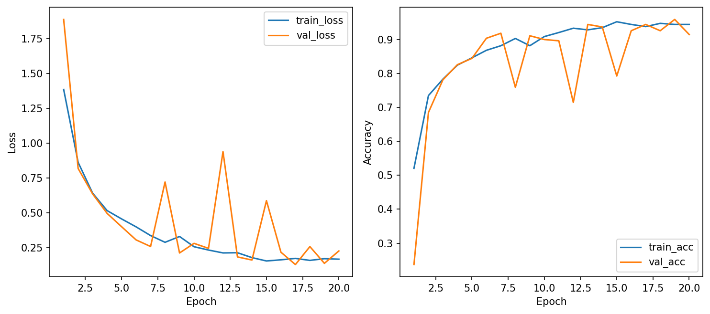
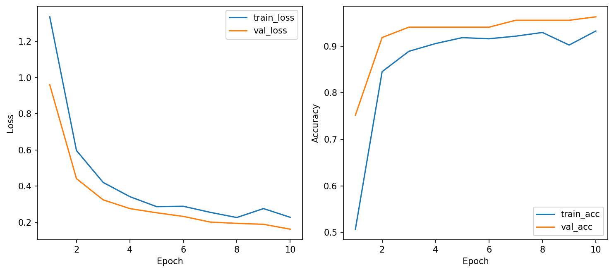
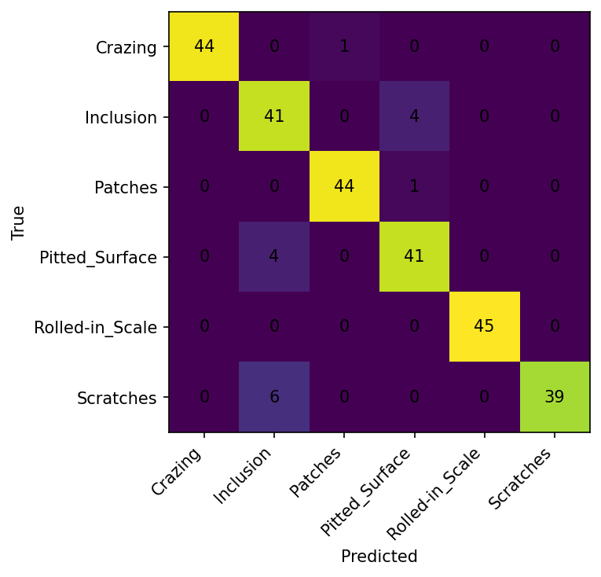
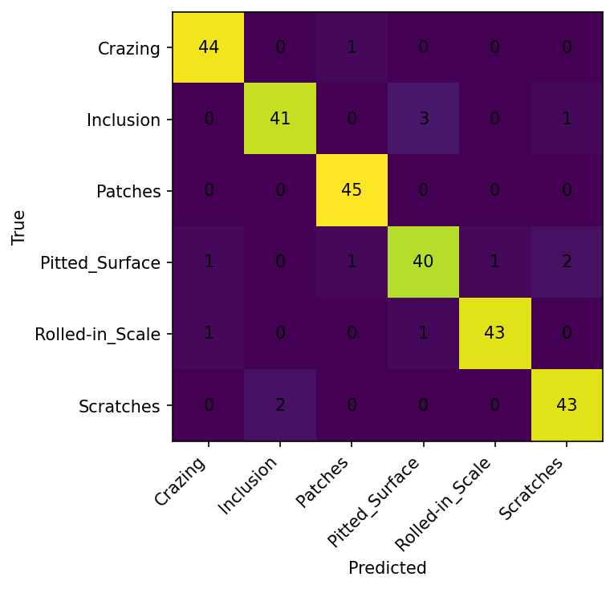

# CSC4005 – Lab 2 Report

## 1. Thông tin chung

- Họ tên: Phan Việt Hùng
- W&B Project: https://wandb.ai/phanhung2004dl-dainam-vietnam/csc4005-lab2-neu-cnn
- Chủ đề: CNN Image Classification – Scratch vs Transfer Learning
- Dataset: NEU Surface Defect Database

---

# 2. Mô tả bài toán

## Mục tiêu

Mục tiêu của bài lab là xây dựng mô hình Deep Learning có khả năng tự động phân loại các lỗi bề mặt trên thép tấm cán nóng bằng Convolutional Neural Networks (CNN).

Các mô hình được sử dụng để so sánh gồm:

- MLP baseline từ Lab 1
- CNN huấn luyện từ đầu (scratch)
- Transfer Learning với ResNet18

Ngoài việc đánh giá độ chính xác, bài lab còn phân tích:
- learning curves,
- khả năng hội tụ,
- hiện tượng overfitting,
- hiệu quả huấn luyện,
- và khả năng tổng quát hóa của từng mô hình.

---

## Dataset

Bộ dữ liệu bao gồm 1.800 ảnh grayscale được chia đều cho 6 loại lỗi bề mặt:

| Class | Ý nghĩa |
|---|---|
| Crazing | Rạn nứt |
| Inclusion | Tạp chất |
| Patches | Vết bẩn/Vết dán |
| Pitted_Surface | Bề mặt rỗ |
| Rolled-in_Scale | Vảy cán |
| Scratches | Vết trầy xước |

Khác với MLP ở Lab 1 phải flatten ảnh thành vector 1 chiều, CNN giữ nguyên cấu trúc không gian của ảnh, giúp mô hình học được các đặc trưng hình học và texture hiệu quả hơn.

---

# 3. Mô hình và cấu hình huấn luyện

## 3.1. MLP Baseline (Lab 1)

### Cấu hình

- Optimizer: AdamW
- Learning rate: 0.001
- Weight decay: 0.0001
- Dropout: 0.3
- Epochs: 20
- Batch size: 32
- Image size: 64

| Chỉ số | MLP Baseline |
|---|---|
| Best Validation Accuracy | 41.85% |
| Test Accuracy | 38.15% |
| Best Validation Loss | 1.4993 |
| Test Loss | 1.4957 |

### Nhận xét

MLP cho kết quả khá thấp do việc flatten ảnh làm mất mối quan hệ không gian giữa các pixel. Vì vậy mô hình không thể học tốt các đặc trưng texture và hình dạng của lỗi bề mặt.

---

## 3.2. CNN-small (Scratch)

### Cấu hình

- Train mode: scratch
- Optimizer: AdamW
- Learning rate: 0.001
- Weight decay: 0.0001
- Dropout: 0.3
- Epochs: 20
- Batch size: 32
- Image size: 64
- Patience: 5
- Có sử dụng Data Augmentation

### Kiến trúc mô hình

CNN-small gồm:
- Convolution layers
- Batch Normalization
- ReLU activation
- MaxPooling
- Fully Connected classifier

Mô hình được huấn luyện hoàn toàn từ đầu với trọng số khởi tạo ngẫu nhiên.

---

## 3.3. ResNet18 (Transfer Learning)

### Cấu hình

- Backbone: ResNet18
- Train mode: transfer
- Optimizer: AdamW
- Learning rate: 0.001
- Weight decay: 0.0001
- Dropout: 0.3
- Epochs: 10
- Batch size: 32
- Image size: 128
- Patience: 3
- Có sử dụng Data Augmentation

Trong chế độ transfer learning, toàn bộ backbone pretrained được đóng băng (freeze), chỉ huấn luyện phần classifier cuối cùng.

---

# 4. Kết quả thực nghiệm

| Model | Train Mode | Best Val Acc | Test Acc | Epoch Time | Trainable Params | Nhận xét |
|---|---|---:|---:|---:|---:|---|
| MLP | scratch | 41.85% | 38.15% | 6.60 sec | - | Hiệu năng thấp do mất thông tin không gian sau khi flatten ảnh |
| CNN-small | scratch | 94.44% | 94.07% | 4.25 sec | 32,614 | Hiệu quả rất tốt dù số tham số nhỏ, học tốt texture và hình dạng lỗi |
| ResNet18 | transfer | 96.30% | 94.81% | 21.78 sec | 3,078 | Hội tụ ổn định hơn và tận dụng tốt đặc trưng pretrained từ ImageNet |

Kết quả cho thấy CNN vượt trội hoàn toàn so với MLP trong bài toán phân loại ảnh.

---

# 5. Phân tích Learning Curves

## 5.1. CNN-small (Scratch)

### Khả năng hội tụ

CNN-small bắt đầu với validation accuracy khá thấp ở các epoch đầu nhưng tăng rất nhanh sau vài lần huấn luyện. Điều này cho thấy các lớp convolution có khả năng học đặc trưng texture bề mặt rất hiệu quả.

### Độ ổn định

Learning curves có xuất hiện dao động:
- train_loss giảm đều,
- val_loss đôi lúc tăng nhẹ,
- val_acc vẫn tăng ổn định về tổng thể.

Những dao động này chủ yếu do ảnh augmentation tạo ra các mẫu khó hơn cho mô hình.

### Khả năng tổng quát hóa

Dù được train hoàn toàn từ đầu, CNN-small vẫn đạt:
- 94.44% validation accuracy
- 94.07% test accuracy

Điều này chứng minh một CNN nhỏ vẫn đủ khả năng tổng quát hóa rất tốt trên bộ dữ liệu NEU-CLS.

---

## 5.2. ResNet18 (Transfer Learning)

### Hội tụ nhanh hơn

Transfer learning bắt đầu ở vị trí thuận lợi hơn nhiều:
- validation accuracy cao ngay từ các epoch đầu,
- learning curves mượt và ổn định hơn CNN scratch.

Nguyên nhân là ResNet18 đã học được các đặc trưng ảnh mạnh mẽ từ ImageNet.

### Quá trình tối ưu ổn định

So với CNN-small:
- val_loss ít dao động hơn,
- khoảng cách giữa train_acc và val_acc nhỏ,
- mô hình tổng quát hóa tốt hơn.

Backbone pretrained cung cấp các feature extractor mạnh, giúp classifier thích nghi nhanh với dữ liệu lỗi bề mặt thép.

### Hiệu quả huấn luyện

Mặc dù thời gian train mỗi epoch dài hơn (~21.78s/epoch), mô hình chỉ cần cập nhật 3,078 tham số trainable, giúp việc tối ưu ổn định hơn đáng kể.

---

# 6. Phân tích Confusion Matrix

## 6.1. CNN-small (Scratch)

### Các lỗi chính

Mô hình nhầm lẫn nhiều nhất giữa:
- Inclusion
- Pitted_Surface

Ví dụ:
- 4 ảnh Inclusion bị dự đoán thành Pitted_Surface
- 6 ảnh Scratches bị nhầm sang Inclusion

### Nhận xét

Các lớp này có texture khá giống nhau:
- nhiều nhiễu,
- cấu trúc bề mặt không đều,
- chi tiết nhỏ khó phân biệt.

Tuy nhiên:
- Rolled-in_Scale được nhận diện gần như hoàn hảo,
- Patches có độ chính xác rất cao.

Điều này cho thấy một số loại lỗi có đặc trưng hình học rõ ràng hơn các lớp còn lại.

---

## 6.2. ResNet18 (Transfer Learning)

### Sự cải thiện

Transfer learning giảm đáng kể số lượng dự đoán sai so với CNN-small.

Mô hình đạt:
- phân loại chính xác hoàn toàn lớp Patches,
- hiệu quả rất cao với Crazing và Rolled-in_Scale.

### Điểm yếu còn tồn tại

Lớp khó nhất vẫn là:
- Inclusion
- Pitted_Surface

Điều này cho thấy ngay cả pretrained features cũng gặp khó khăn với các texture quá giống nhau.

### Tổng quan

ResNet18 cho kết quả cân bằng hơn giữa các lớp và đạt macro-average tốt hơn CNN-small.

---

# 7. Thảo luận

## Vì sao CNN tốt hơn MLP?

CNN vượt trội hơn MLP vì:
- giữ nguyên cấu trúc không gian của ảnh,
- convolution kernels học được texture cục bộ,
- chia sẻ trọng số giúp giảm số tham số,
- pooling giúp mở rộng receptive field.

Ngược lại, MLP flatten toàn bộ ảnh thành vector 1 chiều nên làm mất thông tin vị trí giữa các pixel.

---

## Vì sao Transfer Learning hiệu quả?

Transfer learning mang lại:
- hội tụ nhanh hơn,
- learning curves ổn định hơn,
- validation accuracy cao hơn,
- khả năng tổng quát hóa tốt hơn.

ResNet18 pretrained đã học được nhiều đặc trưng hình ảnh mạnh mẽ từ ImageNet nên có thể thích nghi nhanh với bài toán mới.

---

## Khi nào nên dùng Transfer Learning?

Transfer learning phù hợp khi:
- dataset nhỏ hoặc vừa,
- cần train nhanh,
- tài nguyên tính toán hạn chế,
- cần kết quả ổn định nhanh chóng.

Train from scratch phù hợp hơn khi:
- dataset cực lớn,
- dữ liệu quá đặc thù,
- cần thiết kế mô hình lightweight riêng cho deployment.

---

# 8. Kết luận

Bài lab đã chứng minh hiệu quả vượt trội của CNN trong bài toán phân loại ảnh lỗi bề mặt thép.

### Kết quả chính

- CNN vượt trội hoàn toàn so với MLP nhờ giữ được cấu trúc không gian của ảnh.
- CNN-small đạt hiệu năng rất cao dù chỉ có khoảng 32k tham số trainable.
- Transfer learning với ResNet18 giúp mô hình ổn định hơn và tăng validation accuracy.
- Feature pretrained từ ImageNet giúp mô hình hội tụ nhanh và tổng quát hóa tốt hơn.

### Tổng kết

- CNN-small có tỷ lệ hiệu năng/tốc độ rất tốt.
- ResNet18 Transfer Learning cho kết quả ổn định và mạnh nhất trong thực nghiệm.

Kết quả thực nghiệm cho thấy CNN là lựa chọn rất phù hợp cho các bài toán industrial surface defect classification.